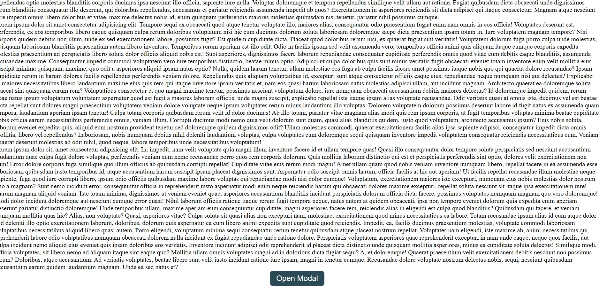
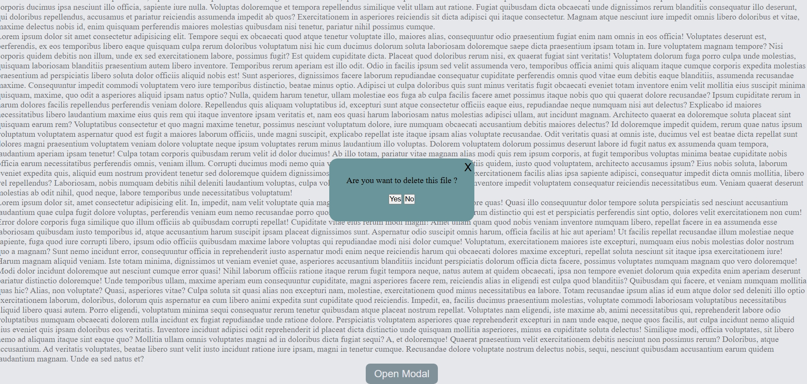
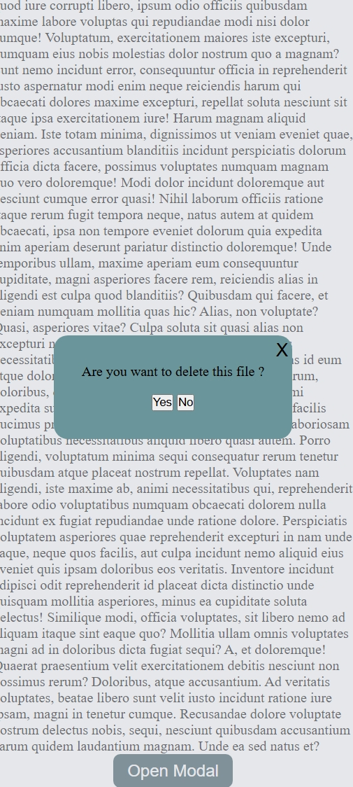

# 🪟 JavaScript Modal Component


A reusable and interactive **Modal (Popup) Component** built using **Vanilla JavaScript**, demonstrating real-world UI behavior such as opening, closing, and overlay handling.

---

## 🚀 Live Demo

🌐 **Live App:** https://khushi-66.github.io/javascript-modal-component/

📂 **GitHub Repository:** https://github.com/khushi-66/javascript-modal-component

---

## 🎥 Live Preview


---

## 📌 Overview

This project demonstrates how to build a **custom modal component from scratch** using JavaScript without any external libraries.

It focuses on:

* DOM manipulation for dynamic UI
* Event handling for user interactions
* Managing UI state manually
* Building reusable UI components

---

## 🧠 Key Learnings

* Creating and controlling modal components
* Handling click events (open/close actions)
* Managing overlay and background interaction
* Preventing unintended UI behavior
* Writing clean, reusable JavaScript logic

---

## 📸 Screenshots

### 🪟 Modal Closed State



### 📂 Modal Open State




### 📱 Mobile View



---

## ✨ Features

* 🪟 Open modal on button click
* ❌ Close modal using close button
* 🖱️ Close modal on outside click (overlay)
* ⌨️ Close modal using keyboard (Esc key) *(if implemented)*
* 🎯 Smooth and intuitive user interaction
* 📱 Fully responsive design

---

## ⚡ Performance & Optimization

* Lightweight implementation (no libraries)
* Efficient DOM manipulation
* Minimal reflows and re-renders
* Clean and scalable code structure

---

## 🛠️ Tech Stack

| Technology            | Usage     |
| --------------------- | --------- |
| **HTML5**             | Structure |
| **CSS3**              | Styling   |
| **JavaScript (ES6+)** | Logic     |

---

## 🌐 Deployment

This project is deployed using **GitHub Pages**, making it accessible globally.

### 🚀 Deployment Process:

* Uploaded project to GitHub repository
* Enabled GitHub Pages in repository settings
* Selected main branch for deployment
* Generated a public live URL

---

## 📂 Project Structure

```bash
javascript-modal-component/
│── index.html
│── style.css
│── script.js
│── screenshots/
│── assets/
│── README.md
```

---

## ⚙️ Installation & Setup

```bash
git clone https://github.com/khushi-66/javascript-modal-component.git
cd javascript-modal-component
```

Open `index.html` in your browser 🚀

---

## 📈 Future Improvements

* 🎨 Add animation & transitions
* 🔄 Multiple modals support
* 🔐 Accessibility improvements (ARIA roles)
* 🎯 Reusable modal utility function
* 🌙 Dark mode styling

---

## 💡 Real-World Use Cases

* Login / Signup popup
* Confirmation dialogs
* Notifications & alerts
* Image previews / galleries
* Forms inside modal

---

## 👩‍💻 Author

**Khushi Sahu**
🔗 https://github.com/khushi-66

---

## ⭐ Support

If you like this project, give it a ⭐ on GitHub!
